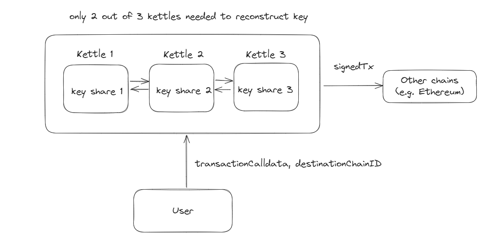

## suave-mpc

This is part of ETH Global London 2024 Hack. The motivation is to leverage SUAVE's trusted execution environment to coordinate threshold secret sharing, where a user's signing key is split into multiple shares and stored in different SUAVE nodes (using SUAVE's confidential compute request). Users can then submit transaction calldata, where the signing key is reconstructed inside SUAVE to sign the transaction calldata. The resulting signed transaction can be submitted to other chains. As such, the user does not need to manually manage multiple keys on different chains.

### Prerequisites

Required packages:
- [Foundry Forge](https://book.getfoundry.sh/forge/)
- [Bun](https://bun.sh/)

### Getting Started

To run a local SUAVE node, run the following: 
1. `curl -L https://suaveup.flashbots.net | bash` to download the node
2. `suave-geth --suave.dev` to start the node

Next, deploy contracts to the local node:
- `forge script script/Setup.s.sol:SetupScript --rpc-url http://localhost:8545 --broadcast`

Run the script to send confidential request to the contract:
- Get the deployed contract address and update the `keyManagementContractAddress` in `index.ts`
- `bun run index.ts`

You can also run the test script:
- `forge test --ffi`

### Future Work

There are a few areas to make it a more comprehensive solution:
1. Threshold signature: currently the private keys are reconstructed before signing the transaction calldata. A better alternative would be for each key share to separately sign the transaction before aggregating the signature.
2. Cross chain call: in the current implementation, we haven't yet implemented the cross chain RPC call. We can just use SUAVE's API to do so.
3. Kettle isolation: we should store the each key share in different kettles, this will increase the security in case of compromise.

### Acknowledgements

Thanks to the Flashbots team for explanining and debugging various integrations, along with help on the secret sharing library.
